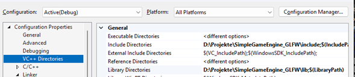

# Slime Engine - C++ Graphics Engine

> A simple 3D graphics engine built in C++ featuring physics, lighting, collision detection, and a demo game where you control a **slime cube** through a maze.

---

## Features

- 3D rendering engine written in C++
- Physics system (gravity, bounces, collisions)
- Basic lighting and shadow support
- Death and respawn mechanics
- Zenithal view
- Demo game: *Slime Labyrinth* 🌀

---

## Technologies

The following technologies were used:

- [CMake](https://cmake.org/)  
- [GLFW](https://www.glfw.org/)  
- [GLAD](https://glad.dav1d.de/)  
- [OpenGL](https://www.opengl.org/)  

---

## ⚙️ Installation

-After cloning the repository, you must open the sln project and enter Proyect-> Properties

-Inside, you must update the **Include** and **Library** directories to the **include** and **lib** folders respectively

-Also, inside Linkers->Input you must add the **glfw3.lib** and **opengl32.lib** dependencies

-After that, you can make use of it!
